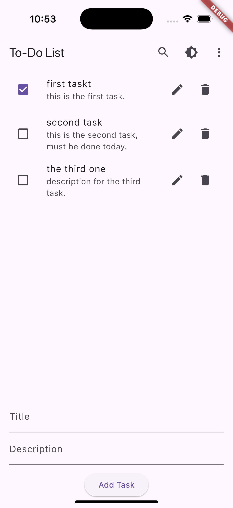
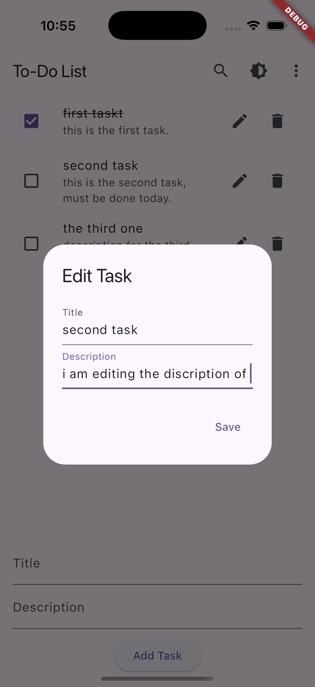
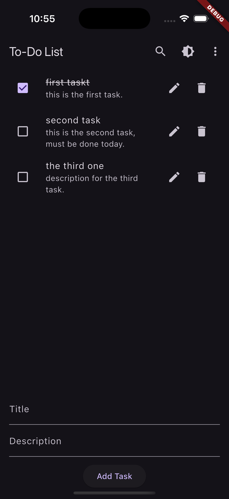
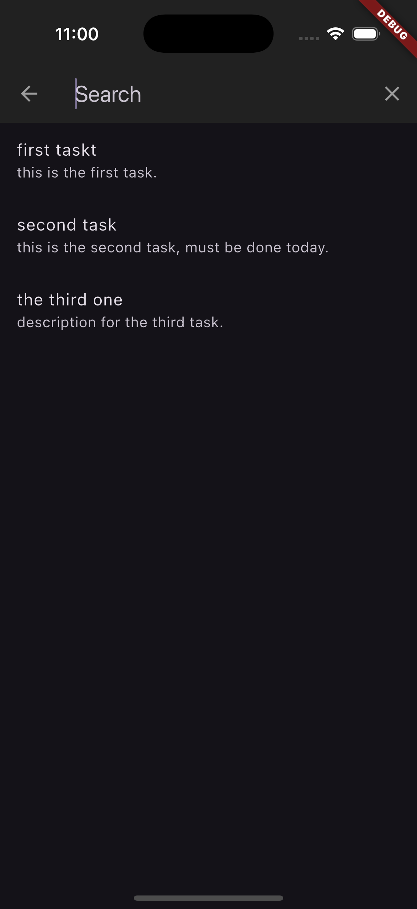
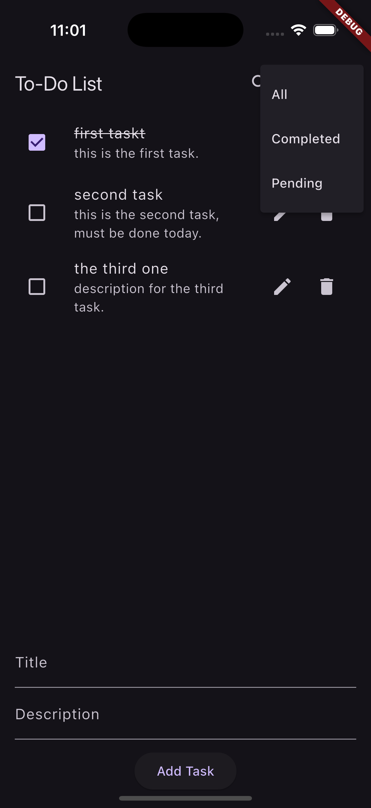
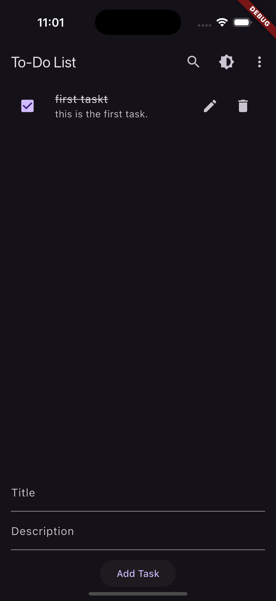
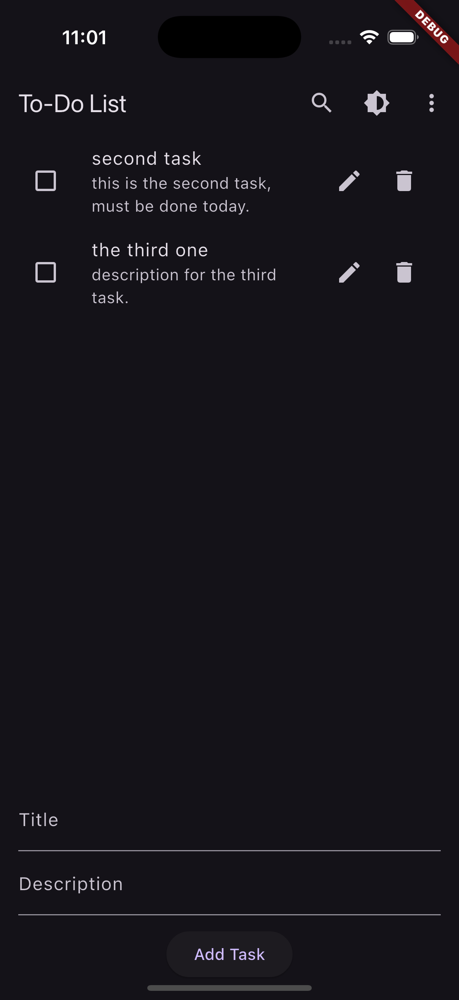

# 📝 **To-Do List App**

A simple and interactive To-Do List app built using **Flutter**. This app allows users to manage their daily tasks, organize them into categories, and track their progress with a clean and modern user interface.

---

## 🚀 **Features**

### ✅ **Task Management**
- **Add Tasks**: Users can add tasks with a title and optional description.
- **Edit Tasks**: Modify the title or description of existing tasks.
- **Delete Tasks**: Remove tasks when they are no longer needed.
- **Mark as Complete**: Mark tasks as complete using a checkbox or swipe gesture.

### 🔍 **Search Tasks**
- **Search Bar**: Instantly search tasks by title or description.

### 🌗 **Theme Customization**
- **Light/Dark Mode**: Switch between light and dark themes to reduce eye strain.


---

## 📁 **File Structure**
```
lib/
  ├── main.dart               # Entry point of the app
  ├── screens/
  │      └── home_screen.dart # Main UI screen for the app
  ├── widgets/
  │      ├── task_tile.dart   # Widget to display a single task
  │      ├── task_input.dart  # Widget for adding/editing tasks
  │      └── task_search_delegate.dart # Widget for searching tasks
  └── models/
         └── task.dart        # Task model (title, description, status, etc.)
```

---

## ⚙️ **Installation**

1. **Clone the Repository**
   ```bash
   git clone https://github.com/your-username/todo_list_app.git
   cd todo_list_app
   ```

2. **Install Dependencies**
   ```bash
   flutter pub get
   ```

3. **Run the App**
   ```bash
   flutter run
   ```

> **Note**: Ensure you have Flutter installed and set up correctly on your machine.
> Run `flutter doctor` to check for any issues.

---

## 🔧 **Configuration**

### **App Icon**
- The app icon is stored in the `assets/images/app_icon.jpg` file.
- To update the app icon, replace `app_icon.jpg` with your own image and update the path in **pubspec.yaml**:
  ```yaml
  flutter_icons:
    android: true
    ios: true
    image_path: "assets/images/app_icon.jpg"
  ```

### **Version and Build Number**
- The version and build number are defined in **pubspec.yaml** as:
  ```yaml
  version: 1.0.0+1
  ```
  Update this field before publishing the app to Google Play or the App Store.

---

## 📸 **Screenshots**

| Home Screen | Task Editing | Dark Mode | 
|-------------|--------------|------------|
|  |  |  | 

| Search Bar | Filter:All | Filter:Complete | 
|------------|-------------|--------------|
|  |  |  |


| Filter:Pending |
|------------|
|  |

---


## 🤝 **Contributing**

Contributions are welcome! Follow these steps to contribute:
1. **Fork the repository**
2. **Create a feature branch**
3. **Commit your changes**
4. **Push to the branch**
5. **Open a pull request**

---

## 🛠️ **Troubleshooting**

### **Common Issues**
- **CocoaPods Out of Sync**
  ```bash
  cd ios
  pod install
  cd ..
  flutter clean
  flutter pub get
  flutter run
  ```

- **Build/Run Issues**
  ```bash
  flutter doctor
  ```
  Follow the suggestions listed by Flutter Doctor to resolve issues.

---

## 📜 **License**
This project is licensed under the **MIT License**. You are free to use, modify, and distribute it.

---

## 💬 **Contact**
For any questions or support, please contact [stealthmoud@gmail.com](mailto:stealthmoud@gmail.com).

